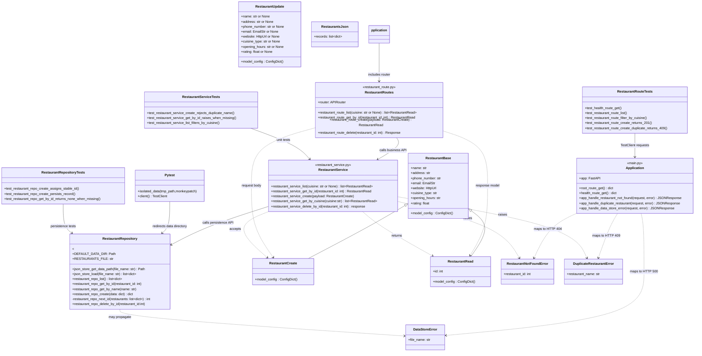

# COSC 310 Team 19 — M0 UML Architecture

Repository inspected: `kunoa2580/cosc310-team19-food-delivery`, branch `main`, tree commit `22e8abe8b353e187810e49d2fa3a15638bb94e79`.

## 1. Proposed unified M0 architecture

The naming rule is **resource → layer → action**:

- Route functions use `restaurant_route_*`.
- Service functions use `restaurant_service_*`.
- Repository functions use `restaurant_repo_*`.
- Generic JSON functions use `json_store_*`.
- The final action vocabulary is consistent: `list`, `get_by_id`, `get_by_name`, `create`, `update`, `deactivate`, and `delete`.

